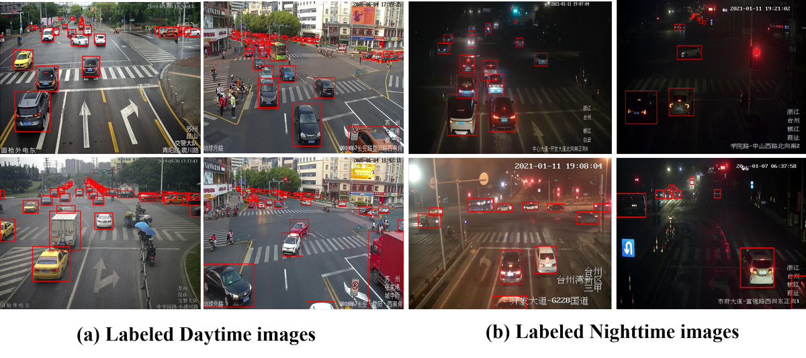

# Vehicle-Detection-from-Surveillance-Videos

## 1. Description 

To facilitate the research of all-day vehicle detection from surveillance videos,  we build a large and detailed benchmark dataset for vehicle detection in the real-world urban surveillance scenario. The featured properties of this dataset include:

- The images are shot from the roadside surveillance cameras located on urban roads (Jiangsu and Zhejiang province, China).
- It includes two sub-dataset, one for daytime and another for nighttime. The daytime dataset contains 5556 labeled images, while there are 8050 images (including 811 labeled images and 7,239 unlabeled images) in the nighttime. 
- The image resolution varies from 1920 × 1080 to 4096 × 2160 and vehicle label types include car, bus, and  truck. Some labeled images are shown the figure below. 
- The dataset has been carefully annotated by a team of nearly 100 people and almost 27,0000 objects have been labeled with 2D bounding boxes. 

## 2. Download

To encourage related research, we will provide the dataset according to your request. Please email your full name and affiliation to the contact person (vvgod at seu dot edu dot cn). We ask for your information only to make sure the dataset is used for non-commercial purposes. We will not give it to any third party or publish it publicly anywhere. 

Different from other datasets, this dataset involves a lot of privacy such as license plate, human face, location information, etc. Therefore, before open source, we have to laboriously erase these private information. Thank you for your kind understanding!

## 3. Citation

Our  paper 《***All-day Vehicle Detection from Surveillance Videos Based on Illumination-Adjustable Generative Adversarial Network***》is submitted to Journal ***《IEEE TRANSACTIONS ON INTELLIGENT TRANSPORTATION SYSTEMS》***,  When accepted, welcome to kindly cite it.

The below figure demonstrates some results of day-to-night translation by our proposed IA-GAN, which could transform labeled daytime images into multiple nighttime images with diverse illumination, using an adjustable illumination vector as input. 

